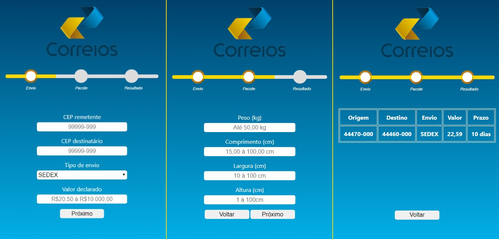

# frete-correios
> Calcula o prazo em dias, e o valor da entrega da encomenda através da API do Correios. Documentação oficial da API: 

<p align="center">
    
</p>

<p align="center">
    
    
    
</p>



## Dependências

1- Servidor Apache

2- PHP 5 ou superior

3- Git

## Instalação

```sh
git clone https://github.com/gacairesdev/frete-correios
```

Abra o seu browser, no servidor apache (Para evitar edição do código, use 'localhost')

<a href="localhost/frete-correios" target="_blank"> localhost/frete-correios </a>

## Exemplo de uso

O uso desse consumo de API, é utilizado para lojas e e-commerces principalmente, para calcular o prazo da entrega da mercadoria e o valor cobrado para esse envio, de acordo com as especificações declaradas.

## Criador

Guilherme Caires – [Linkedin](https://linkedin.com/in/guilherme-caires) – contatogcaires@gmail.com

[https://github.com/gcairesdev](https://github.com/gcairesdev)

## Contribuindo

1. Faça o fork (<https://github.com/gcairesdev/frete-correios/fork>)
2. Crie a branch da sua modificação (`git checkout -b feature/envios`)
3. Commit suas mudanças (`git commit -am ':rocket: Add mais tipos de envio'`)
4. Faça push para sua branch (`git push origin feature/envios`)
5. Crie um Pull Request

### Commit 

- Usar modo imperativo ("Adiciona feature" não "Adicionando feature" ou "Adicionada feature")
- Primeira linha deve ter no máximo 70 caracteres
- Considere descrever com detalhes no corpo do commit
- Obrigatório usar um emoji no início da mensagem de commit

Emoji | Código | Tipo do commit
------------ | ------------- | -------------
:tada: | `:tada:` | initial commit
:art: | `:art:` | quando melhorar a estrutura/formato do código
:racehorse: | `:racehorse:` | quando melhorar a performance
:memo: | `:memo:` | quando escrever alguma documentação
:bug: | `:bug:` | quando corrigir um bug
:fire: | `:fire:` | quando remover código ou arquivos
:lock: | `:lock:` | quando melhorar a segurança
:poop: | `:poop:` | deprecated
:construction: | `:construction:` | em construção
:rocket: | `:rocket:` | nova feature
:see_no_evil: | `:see_no_evil:` | gambiarra
:gift: | `:gift:` | nova versão 

### Exemplo
```bash
git commit -m ":memo: Adiciona instruções de contribuição
>
> Foi criado o arquivo README.md com as instruções de
> como fazer um bom commit
``` 